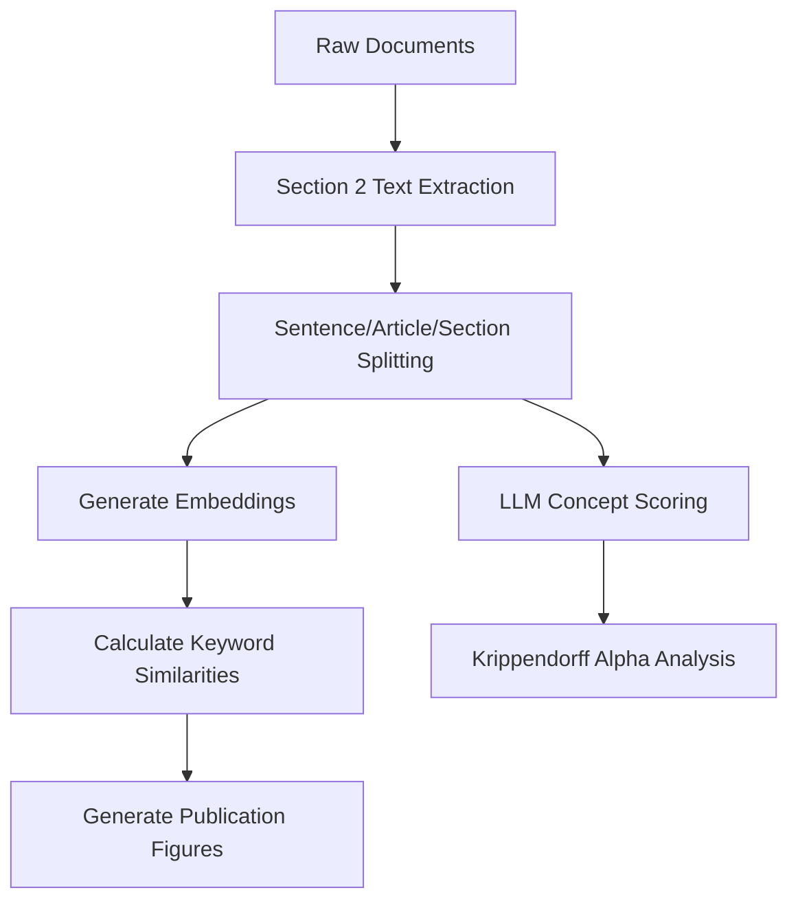

# Pragmatic Moral Governance Analysis Pipeline

**Streamlined analysis pipeline for Chinese "Promotion of Civilised Behaviour" municipal regulations research.**

## 🎯 Quick Start

```bash
# Clone and run the complete analysis
git clone https://github.com/[username]/pragmatic_moral_governance && cd pragmatic_moral_governance

# Set up environment (copy and edit .env.example)
cp .env.example .env
# Edit .env to set your OPENAI_API_KEY and data paths

# Check system status
make verify

# Generate 3 publication figures (fast)
make final-figures

# Generate everything for publication (requires OpenAI API key)
make all
```

## 📊 Research Overview

This project analyzes Chinese municipal "Promotion of Civilised Behaviour" (文明行为促进) regulations using:
- **Keyword-based similarity analysis** across 9 behavioral categories
- **Multi-level analysis** (sentence, article, section levels)  
- **LLM reliability assessment** using Krippendorff's alpha

**Research Hypothesis**: Municipal regulations predominantly focus on behaviors associated with "public orderliness and good customs" (公序良俗).

**Data Source**: 250+ documents from National Laws and Regulations Database (国家法律法规数据库)

> **Note**: This repository contains only the analysis code. Large data files (>50MB) are excluded and must be obtained separately or regenerated locally.

## 🗂️ Repository Structure

```
├── Makefile                    # Main build pipeline
├── task2_cleanup_and_build_database/
│   ├── code/                   # Analysis scripts
│   ├── out/                    # Generated data (embeddings, similarities)
│   └── ref/                    # Reference data (keywords)
├── task3_analyse_data/
│   ├── code/                   # Visualization scripts
│   └── graphs_and_maps/        # Generated figures
└── docs/                       # Documentation
```

## 🎨 Publication Outputs

The pipeline generates exactly **3 figures** used in the publication:

1. **figure1.png** - Article-level dominant category distribution
2. **figure2.png** - Sentence-level salience scatter plot  
3. **figure3.png** - Section-level similarity ridge plot

Plus **reliability analysis** (Krippendorff's alpha) for all analysis levels.

## ⚙️ System Requirements

### Required Software
- **R** (4.0+) with packages auto-installed via `librarian::shelf()`
- **Python 3.11+** with [uv](https://github.com/astral-sh/uv) for dependency management
- **Make** (standard on Unix systems)

### Environment Configuration
- **Copy and configure**: `cp .env.example .env`
- **OpenAI API key** (only needed for `krippendorff-all` reliability analysis)
  - Add to `.env`: `OPENAI_API_KEY=your_key`
  - Cost: ~$5-10 for full reliability analysis

### Installation
```bash
# Install uv (Python dependency manager)
curl -LsSf https://astral.sh/uv/install.sh | sh

# Install R (if not already installed)
# macOS: brew install r
# Ubuntu: apt-get install r-base
# Windows: Download from https://cran.r-project.org/
```

## 🚀 Usage

### Main Commands
```bash
make all                    # Generate everything (default)
make final-figures          # Generate 3 figures only (fast)
make krippendorff-all      # Generate reliability analysis
make verify                # Check pipeline status
make help                  # Show all available commands
```

### Development Commands  
```bash
make embeddings            # Generate embeddings (expensive!)
make keyword-similarities  # Generate similarity data
make clean-graphs          # Clean visualizations only (safe)
```

## 📁 Data Pipeline



### Key Data Files
- **Input**: `task2_cleanup_and_build_database/out/section2.csv` (250 documents)
- **Keywords**: `task2_cleanup_and_build_database/ref/category_keywords.csv` (9 categories)  
- **Embeddings**: `*_embeddings.csv` files (~17K total text units)
- **Similarities**: `*_similarities.csv` files (keyword-text similarity scores)

## 🔍 Nine Behavioral Categories

1. **Public Order** (public_order) - Safety, traffic, noise regulations
2. **Public Etiquette** (public_etiquette) - Courtesy, respect, social manners  
3. **Public Health** (public_health) - Hygiene, health protection measures
4. **Family Relations** (family_relations) - Family harmony, filial piety
5. **Business Professional** (business_professional) - Commercial conduct, professional ethics
6. **Revolutionary Culture** (revolutionary_culture) - Patriotism, Party loyalty
7. **Ecological Concerns** (ecological_concerns) - Environmental protection
8. **Voluntary Work** (voluntary_work) - Community service, charity
9. **Socialist Core Values** (socialist_core_values) - Ideological principles

## 🧹 Cleaning Up

```bash
make clean-graphs          # Remove visualizations (safe)
make clean-similarities    # Remove similarity data  
make clean-scores          # Remove LLM scoring database
make clean-embeddings      # Remove embeddings (expensive to regenerate!)
make clean-all             # Remove everything (requires confirmation)
```

## 🐛 Troubleshooting

### Common Issues

**"No such file or directory" errors**
- Run `make verify` to check what's missing
- Run `make embeddings` to generate foundation files

**R package installation failures**  
- Packages are auto-installed via `librarian::shelf()`
- Manual install: `install.packages(c("tidyverse", "ggplot2", "ggridges"))`

**Python/uv issues**
- Install uv: `curl -LsSf https://astral.sh/uv/install.sh | sh`
- Scripts use inline dependencies with `uv run`

**OpenAI API errors**
- Only needed for `krippendorff-all`  
- Set API key: `export OPENAI_API_KEY=your_key`
- Skip with: `make final-figures` (no API needed)

### File Size Issues

Some generated files exceed 50MB (embeddings data) and are excluded from this repository:
- Run `make embeddings` to generate them locally (requires OpenAI API key)
- Large files are automatically cached and won't regenerate unnecessarily
- The complete analysis pipeline works from raw data to final figures

## 📖 Documentation

- **[docs/PIPELINE.md](docs/PIPELINE.md)** - Detailed technical documentation
- **Makefile** - Self-documenting build system (`make help`)
- **Code comments** - All analysis scripts are documented

## 📜 Citation

If you use this code or data, please cite:

```bibtex
@article{pragmatic_moral_governance,
  title={Pragmatic Moral Governance: Analysis of Chinese Municipal Civilized Behavior Regulations},
  author={[Author names]},
  journal={[Journal name]},
  year={2024},
  note={Analysis pipeline available at https://github.com/[username]/pragmatic_moral_governance}
}
```

## 📝 License

[License to be specified]